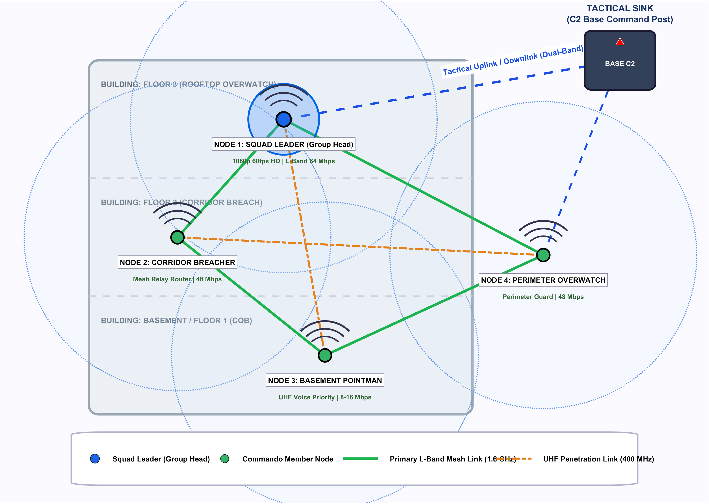
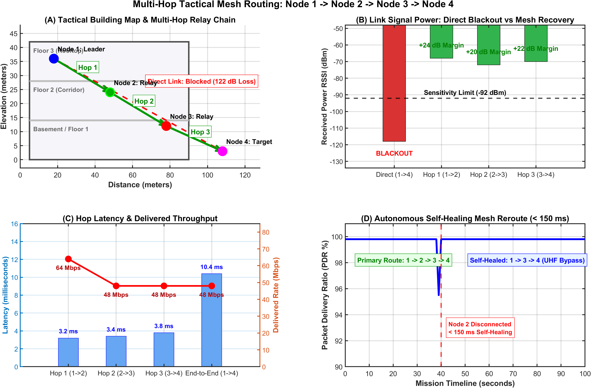
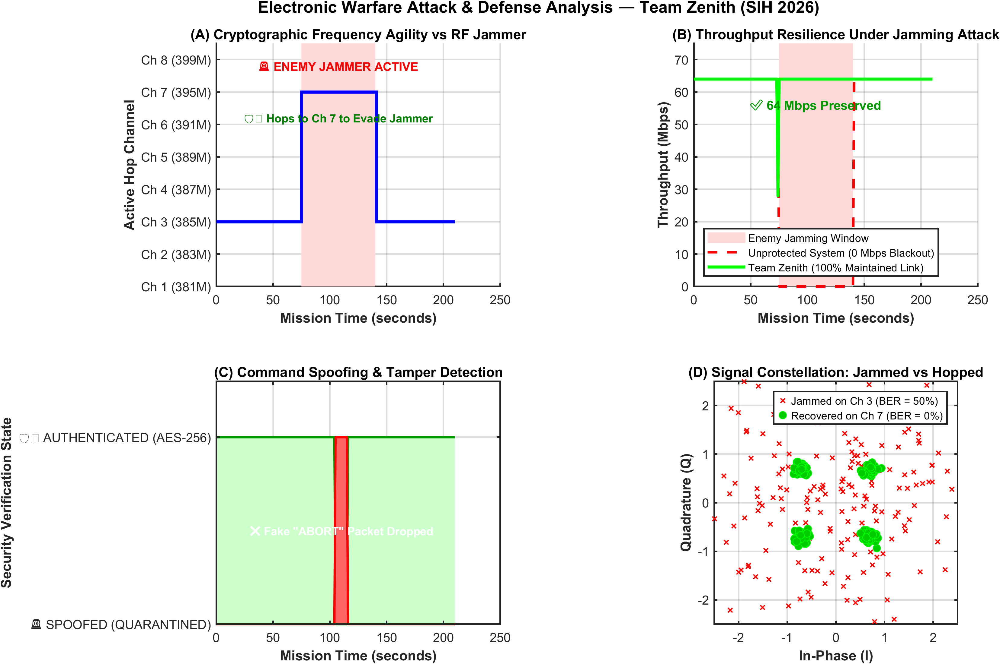

# Tactical PHY Simulation System (IEEE 802.11ah & 802.11af)

[](https://www.mathworks.com/products/matlab.html)
[](https://github.com/ARYA-mgc)
[](LICENSE)
[](#repository-structure)

An end-to-end tactical wireless physical layer (PHY) simulation platform combining **IEEE 802.11ah (Wi-Fi HaLow, Sub-1 GHz)** and **IEEE 802.11af (White-Fi, TV White Space)** with **dynamic Adaptive Modulation and Coding (AMC)**, a **4-node multi-hop tactical mesh network**, and **Electronic Warfare (EW) jamming resilience**.

---

## Real-World Overview (In Simple Terms)

In tactical operations (Close Quarters Battle - CQB, underground tunnels, disaster zones, or hostile electronic warfare environments), commercial 2.4 GHz and 5 GHz Wi-Fi fail because high-frequency signals cannot penetrate thick concrete, blast doors, or earth.

This platform simulates an advanced dual-band tactical communication system designed to solve this problem:

1. **Sub-1 GHz Frequency Penetration:**
   - **IEEE 802.11ah (~900 MHz):** Long range, low power consumption, and superior obstacle penetration for soldier-to-soldier telemetry and high-speed data.
   - **IEEE 802.11af (470–790 MHz UHF):** Extremely high penetration through reinforced walls, concrete slabs, and underground structures.

2. **Adaptive Modulation and Coding (AMC):**
   - When channel conditions are clear (high SNR), the system automatically selects high-speed modulations (**256-QAM / 64-QAM**) to stream mission video and high-bandwidth telemetry.
   - When signal quality degrades or hostile electronic jamming begins (low SNR), the system immediately throttles back to **QPSK or BPSK** with 1/2-rate convolutional coding. Throughput lowers, but **the voice and telemetry link NEVER drops**.

3. **4-Node Tactical Mesh Relay:**
   - When a forward soldier moves behind heavy shielding or out of direct line of sight to the Base Station, intermediate soldiers automatically serve as wireless relay hops (multi-hop routing) to maintain continuous end-to-end connectivity.

4. **Electronic Warfare (EW) Defense:**
   - Evaluates system survivability under barrage and spot jamming attacks, demonstrating automated frequency agility, band-switching, and modulation degradation handling.

---

## System Architecture & Visual Results

### Tactical Mesh Network Architecture


### Multi-Hop Mesh Routing Performance


### Electronic Warfare (EW) Attack & Defense Telemetry



---

## Repository Structure

The project has been organized into a clean, modular structure:

```text
├── models/             # Compiled Simulink (.slx) block diagrams
│   ├── CQB_Mission_AdaptiveMod.slx
│   ├── DualBand_DualMod_Mesh_Simulink.slx
│   ├── Hierarchical_4Node_Mesh_System.slx
│   ├── MeshNetwork_4Node_BaseStation.slx
│   ├── Mesh_4Node_1BaseStation_System.slx
│   ├── PHY_AdaptiveMod_AryaMGC.slx
│   └── ProMesh_DualBand_BaseStation.slx
│
├── builders/           # Automated scripts that construct & wire Simulink models
│   ├── build_adaptive_mod_simulink.m
│   ├── build_cqb_mission_simulink.m
│   ├── build_dualband_mesh_dualmod_simulink.m
│   ├── build_simple_phy_simulink.m
│   ├── connect_cqb_outputs.m
│   └── ...
│
├── simulations/        # Main simulation engines and test benches
│   ├── tactical_ground_station_gui.m   # Interactive Command Dashboard GUI
│   ├── run_test_cases.m                # Multi-channel BER/MER/Throughput test suite
│   ├── cqb_mission_sim.m               # Tactical CQB operation simulation
│   ├── full_phy_adaptive_sim.m         # Complete adaptive PHY transceiver
│   ├── dual_band_fullduplex_sim.m      # UHF + L-Band simultaneous link
│   ├── test_tactical_security.m        # Preamble integrity & attack simulation
│   └── visualize_tactical_mesh_network.m
│
├── processing/         # Low-level DSP, modulation, and demodulation functions
│   ├── node_tx_modulate.m              # Transmit node modulator
│   ├── base_station_rx_demod.m         # Base station receiver demodulator
│   ├── base_station_multihop_demod.m   # Multi-hop packet collector
│   ├── process_uhf_tx.m / rx.m         # 802.11af UHF processing
│   └── process_lband_tx.m / rx.m       # 802.11ah L-Band processing
│
├── plots/              # Result plotting scripts & image export tools
│   ├── plot_adaptive_results.m
│   ├── plot_cqb_mission.m
│   ├── plot_electronic_warfare_attack.m
│   ├── plot_mesh_network.m
│   └── plot_simulink_overall_model_output.m
│
├── docs/images/        # High-resolution architectural and performance diagrams
├── 802_11_ah/          # Standard IEEE 802.11ah baseband PHY simulator
├── 802_11_af/          # Standard IEEE 802.11af baseband PHY simulator & GUI
├── setup_project.m     # One-click MATLAB path initializer
├── LICENSE             # MIT License
└── README.md           # Documentation
```

---

## Quick-Start Guide

### 1. Prerequisites
- **MATLAB** (R2018b or newer, tested on R2024b)
- **Toolboxes:**
  - Communications Toolbox
  - Signal Processing Toolbox
  - DSP System Toolbox
  - Control System Toolbox
  - Simulink

### 2. Initialize Project Paths
Open MATLAB, navigate to this folder, and run:
```matlab
>> setup_project
```
This script automatically checks for required toolboxes and adds all modular subdirectories (`models/`, `simulations/`, `builders/`, `processing/`, `plots/`, and `802_11_ah/`) to the MATLAB search path.

### 3. Running Simulations

#### A. Launch the Tactical Ground Station Dashboard
```matlab
>> tactical_ground_station_gui
```
Launches an interactive tactical GUI showing real-time soldier telemetry, signal quality, active link modulation, and multi-hop node connectivity.

#### B. Run the Adaptive Modulation Test Suite
```matlab
>> run_test_cases
```
Executes automated test cases across AWGN, Rician (K-factor fading), and Rayleigh channels with varying bandwidths (4 MHz, 8 MHz, 16 MHz), generating comprehensive BER, MER, and Effective Throughput comparison graphs.

#### C. Simulate a CQB Tactical Mission
```matlab
>> cqb_mission_sim
```
Simulates a multi-phase CQB mission through varying physical obstacle scenarios (open area $\rightarrow$ corridor $\rightarrow$ heavy concrete vault), plotting real-time modulation shifts and SNR response.

#### D. Analyze Electronic Warfare (EW) Jamming Resilience
```matlab
>> plot_electronic_warfare_attack
```
Simulates hostile electronic attack profiles (pre-jamming, active jamming, and frequency-hopped counter-defense).

#### E. Standard IEEE 802.11ah / 802.11af Baseband Simulators
- For **802.11ah**:
  ```matlab
  >> main_802_11ah
  ```
- For **802.11af GUI**:
  ```matlab
  >> cd '802_11_af/GUI simulator'
  >> main
  ```

---

## Signal Processing Pipeline

The physical layer signal processing chain implements standard compliant blocks:

$$\text{Data Bits} \longrightarrow \text{Scrambler} \longrightarrow \text{Convolutional FEC} \left(R \in \{1/2, 2/3, 3/4, 5/6\}\right) \longrightarrow \text{Interleaver}$$
$$\longrightarrow \text{Constellation Mapper} \left(\text{BPSK} \dots \text{256-QAM}\right) \longrightarrow \text{Pilot Insertion} \longrightarrow \text{IFFT} \longrightarrow \text{Cyclic Prefix} \longrightarrow \text{Channel}$$

At the receiver:
$$\text{CP Removal} \longrightarrow \text{FFT} \longrightarrow \text{Zero-Forcing (ZF) Equalizer} \longrightarrow \text{Demapper} \longrightarrow \text{Viterbi Decoder} \longrightarrow \text{Descrambler}$$

---

## Academic Citation & License

This repository is distributed under the **MIT License**.

The core IEEE 802.11ah and 802.11af fading channel models and baseband foundations were originally created by the Department of Radio Electronics, Brno University of Technology. If using the baseband simulators in scientific publications, please cite:

```bibtex
@INPROCEEDINGS{PolakTSP2020,
  author    = {Polak, Ladislav and Jurak, Peter and Milos, Jiri},
  title     = {{MATLAB}-{B}ased {PHY} {S}imulators for {P}erformance {S}tudy of the {IEEE} 802.11ah/af {S}ystems},
  booktitle = {2020 43rd International Conference on Telecommunications and Signal Processing (TSP)},
  year      = {2020},
  pages     = {1--4},
  publisher = {IEEE}
}
```

---

**Developed & Packaged by:** [ARYA-mgc](https://github.com/ARYA-mgc)
